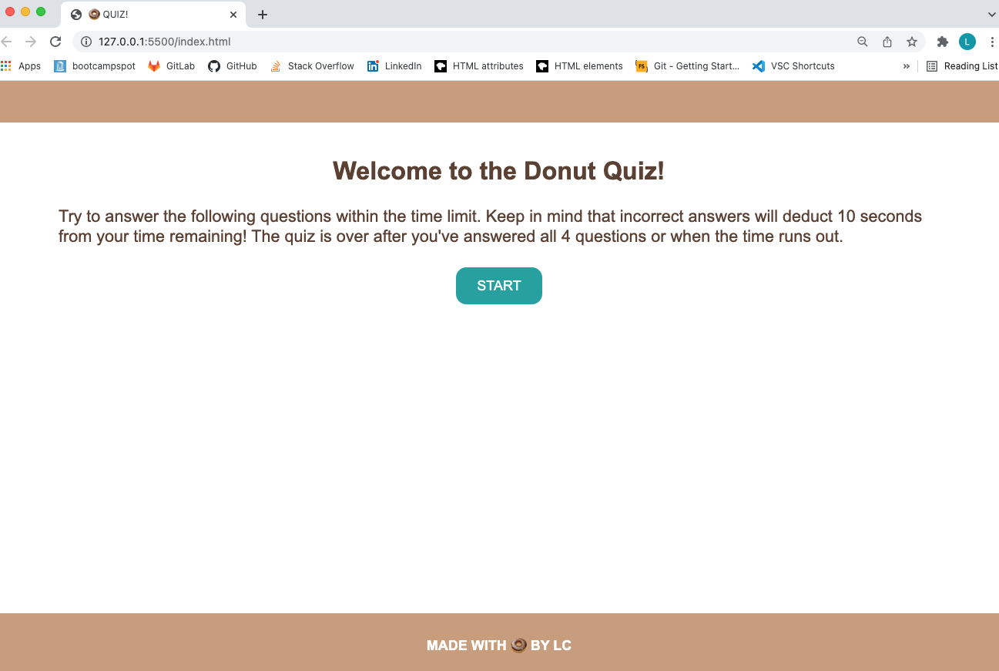
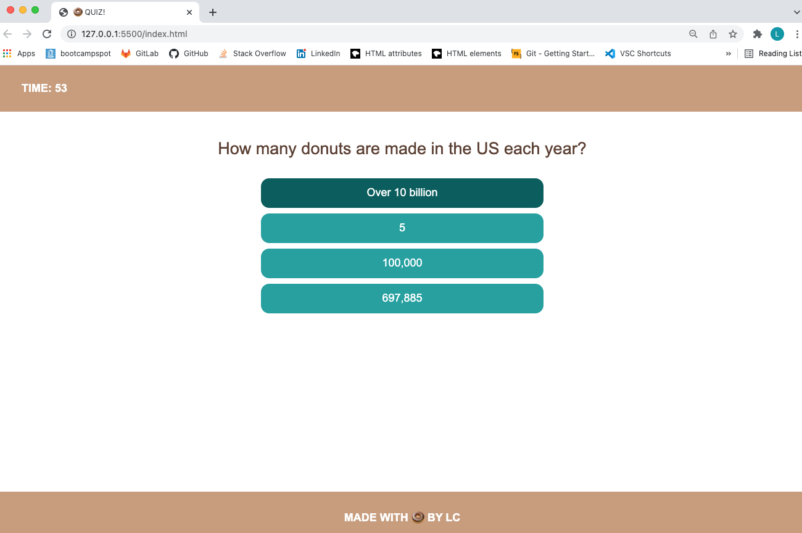
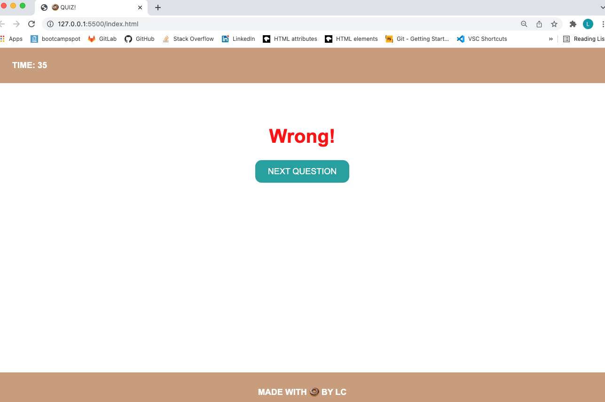
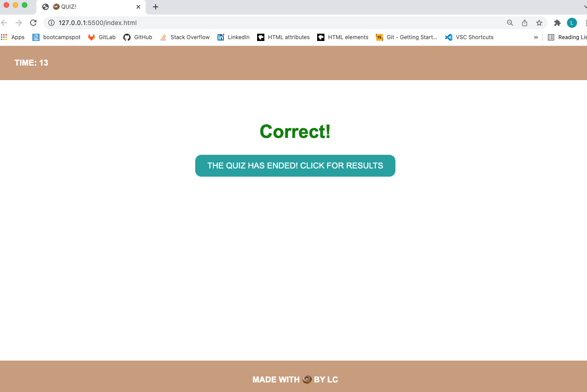
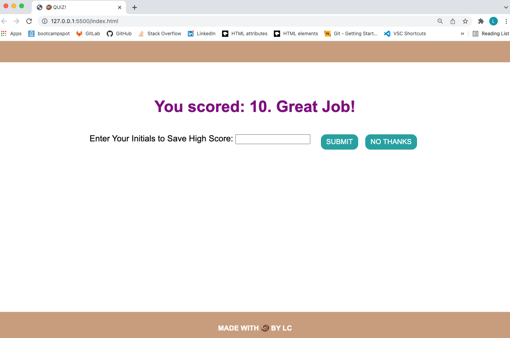
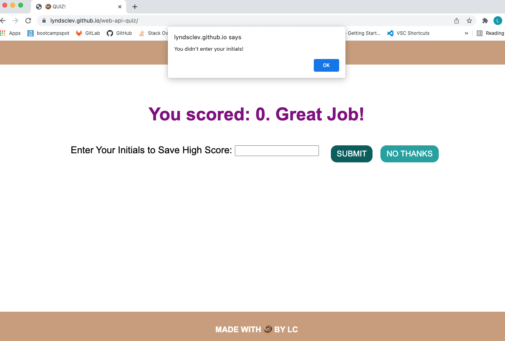
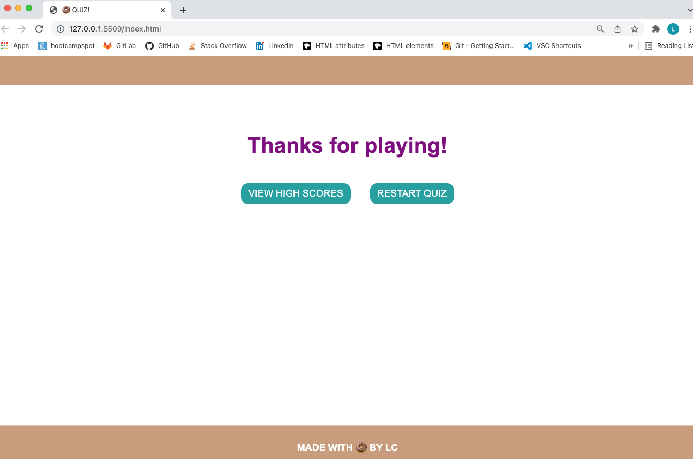
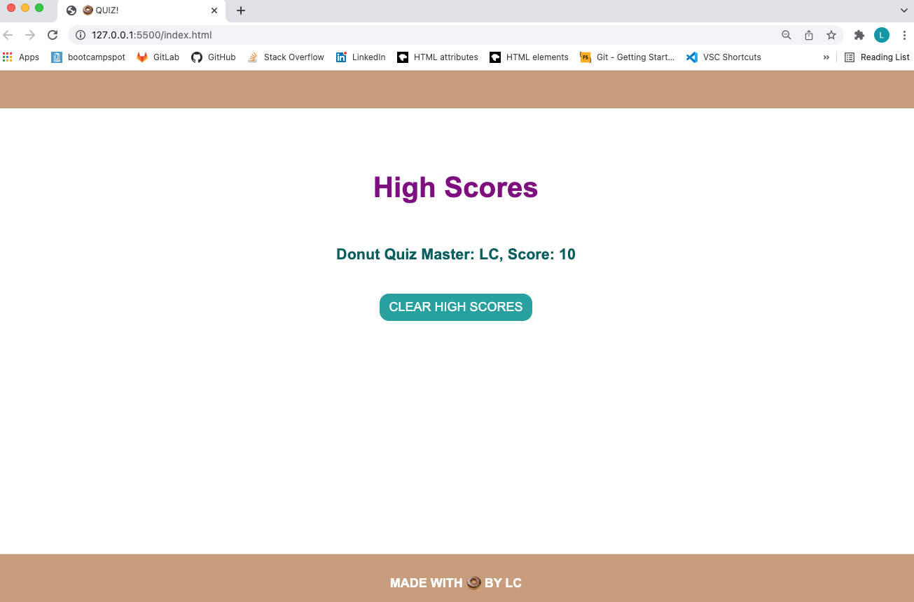
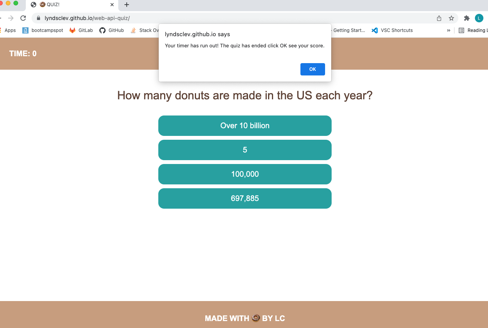

# Web API Quiz Assignment

## Purpose

Build a timed code quiz that's made up of multiple-choice questions. This app will run in the browser and feature dynamically updated HTML and CSS powered by your JavaScript code. It will also feature a clean and polished user interface and be responsive, ensuring that it adapts to multiple screen sizes.

## Technologies Used

* HTML 
* CSS 
* JavaScript

## Deployed Application 

* Repo: https://github.com/lyndsclev/web-api-quiz
* App: https://lyndsclev.github.io/web-api-quiz/

## Images

